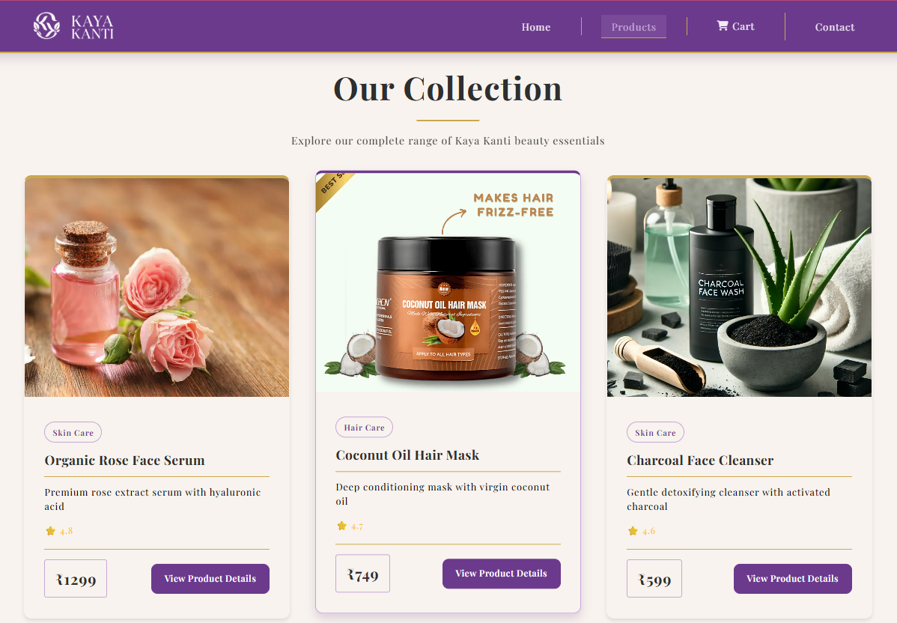
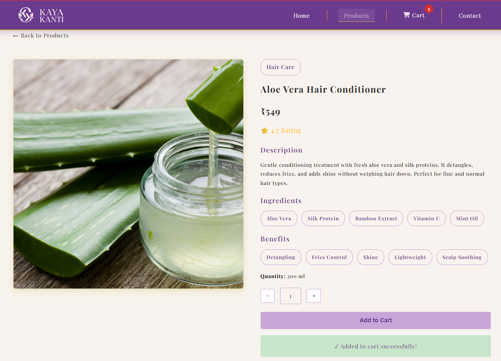
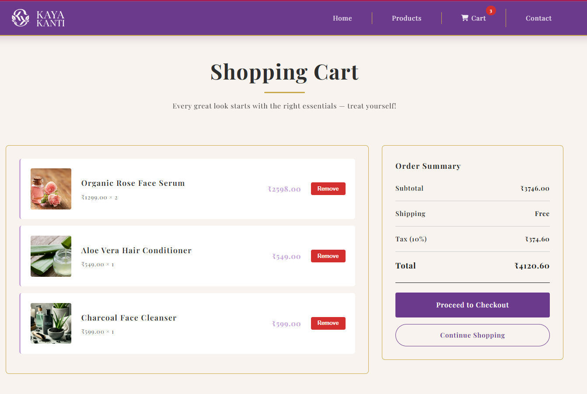
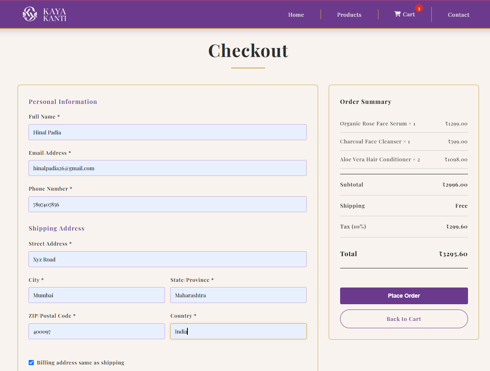
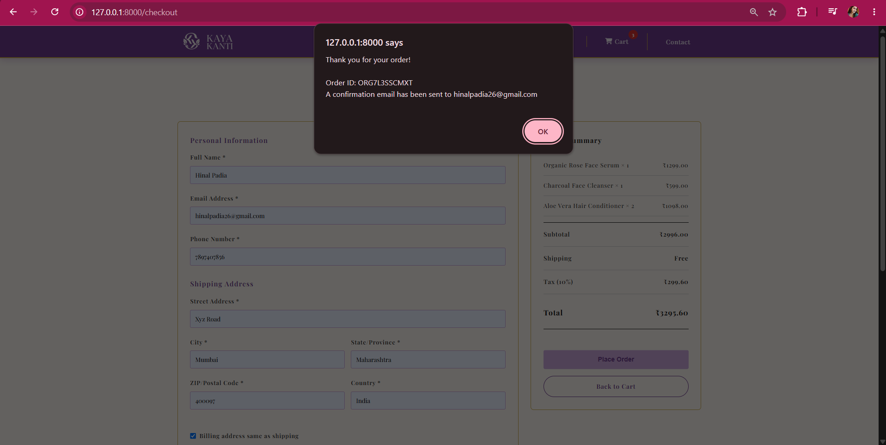

# ✨ Kaya Kanti — Celebrating Indian Beauty

A **Pure Node.js E-Commerce Web Application** for organic skincare and haircare products, built without any external application framework.

---

##  Project Overview

**Kaya Kanti** is a dynamic e-commerce website developed using **core Node.js modules** without Express.js or third-party frameworks.

The project uses a **template-based rendering system** to generate dynamic HTML pages and manages product information through JSON-based data storage.

It demonstrates fundamental backend concepts such as routing, file handling, server creation, and dynamic content rendering using Node.js.

### Features

-  Pure Node.js architecture (`http`, `fs`, `url`, `path` modules only)
-  Browser-side vanilla JavaScript for cart, checkout, and UI interactions
-  Google Fonts and Font Awesome loaded from CDN
-  Dynamic template rendering with placeholder replacement
-  Full e-commerce workflow: Browse → Product Details → Cart → Checkout
-  Responsive, luxury UI with Indian organic brand aesthetic (purple & gold)
-  Local storage–based persistent shopping cart
-  Product filtering by category (Skin Care, Hair Care)
-  Contact page
-  JSON API endpoint for products
-  Mobile-first responsive design
-  404 & 500 error pages

---

## Technologies Used

| Layer           | Technology                                         |
| --------------- | -------------------------------------------------- |
| Runtime         | Node.js (v12+)                                     |
| Server          | `http` (core module)                               |
| Routing         | `url` (core module)                                |
| Files           | `fs`, `path` (core modules)                        |
| Frontend        | HTML5, CSS3 (Grid, Flexbox), Vanilla JS            |
| Browser APIs    | DOM, `localStorage` (cart persistence)             |
| External assets | Google Fonts, Font Awesome, remote product imagery |
| Dev Tool        | `nodemon` (auto-reload)                            |

## Project Structure

```
KAYA-KANTI/
├── app.js                           # Main server file
├── package.json                     # Project dependencies
├── dev-data/
│   └── products.json                # Product database (17+ products)
├── templates/
│   ├── template-home.html           # Home page
│   ├── template-products.html       # Products listing page
│   ├── template-product-detail.html # Single product page
│   ├── template-card.html           # Product card component
│   ├── template-cart.html           # Shopping cart page
│   ├── template-checkout.html       # Checkout page
│   └── template-contact.html        # Contact page
└── public/
    ├── kaya-kanti-logo.png        # Brand logo
    ├── kaya-kanti-brand.png       # Brand wordmark
    └── styles.css                 # Global stylesheet
```

---

## Getting Started

## Screenshots

### Home Page


### Products Page



### Product Details Page



### Shopping Cart



### Checkout Page



### Order Confirmation



### Prerequisites

- Node.js (v12 or higher)
- npm

### Installation & Running

1. **Navigate to the project directory**

   ```bash
   cd KAYA-KANTI
   ```

2. **Install dependencies**

   ```bash
   npm install
   ```

3. **Start the server**

   ```bash
   npm start
   ```

   Or with auto-reload (uses nodemon):

   ```bash
   npm run dev
   ```

4. **Open in browser**

   ```
   http://localhost:8000
   ```

---

##  Routes & Pages

### Main Pages

| Route           | Page           | Description                                           |
| --------------- | -------------- | ----------------------------------------------------- |
| `/`             | Home           | Featured products, categories, benefits, testimonials |
| `/products`     | Products       | Full product grid                                     |
| `/product?id=X` | Product Detail | Full product info, add to cart, related products      |
| `/cart`         | Shopping Cart  | Review items, adjust quantities, see totals           |
| `/checkout`     | Checkout       | Shipping info, payment method, order summary          |
| `/contact`      | Contact        | Contact form and brand information                    |

### API

| Route           | Method | Response                   |
| --------------- | ------ | -------------------------- |
| `/api/products` | GET    | All products as JSON array |

### Static Files

| Route                | Purpose                |
| -------------------- | ---------------------- |
| `/public/styles.css` | Application stylesheet |
| `/public/*.png`      | Brand logo assets      |

---

##  Product Data Structure

Each product in `products.json` follows this schema:

```json
{
  "id": 0,
  "productName": "Organic Rose Face Serum",
  "category": "Skin Care",
  "image": "https://...",
  "price": "1299",
  "rating": 4.8,
  "shortDescription": "Premium rose extract serum with hyaluronic acid",
  "description": "Full detailed description...",
  "ingredients": "Organic Rose Extract, Hyaluronic Acid, ...",
  "benefits": "Hydration • Anti-aging • Brightening • ...",
  "quantity": "30 ml"
}
```

> All prices are in **Indian Rupees (₹)**.

---

##  Design & Styling

### Color Scheme

| Variable            | Value     | Usage                        |
| ------------------- | --------- | ---------------------------- |
| `--primary-color`   | `#6b3a8c` | Headers, buttons, accents    |
| `--secondary-color` | `#c7a6d9` | Hover states, secondary UI   |
| `--gold`            | `#c9a84c` | Borders, highlights          |
| `--ivory`           | `#f8f3ee` | Card and section backgrounds |
| `--cream`           | `#e9d3c2` | Page background              |
| `--dark-gray`       | `#2e2e2e` | Body text                    |

### Design Features

- Luxury organic brand aesthetic inspired by Indian beauty brands
- Playfair Display serif typography
- Responsive grid layouts (desktop → tablet → mobile)
- Smooth transitions and hover effects
- Sticky header navigation

---

## 🔧 How Template Rendering Works

The server reads all HTML templates once at startup, then replaces placeholders at request time:

```javascript
const replaceTemplate = (template, product) => {
  return template
    .replace(//g, product.id)
    .replace(//g, product.productName)
    .replace(//g, product.price);
  // ... more replacements
};
```

### Available Placeholders

| Placeholder              | Replaced With                       |
| ------------------------ | ----------------------------------- |
| ``                 | Product ID                          |
| ``        | Product name                        |
| ``           | Product category                    |
| ``              | Product image URL                   |
| ``              | Product price (₹)                   |
| ``             | Product rating                      |
| ``  | Short description                   |
| ``        | Full description                    |
| ``   | Formatted ingredient `<span>` tags  |
| ``      | Formatted benefit `<span>` tags     |
| ``           | Product quantity/size               |
| `` | Skin Care product cards (home page) |
| `` | Hair Care product cards (home page) |
| ``       | All product cards (products page)   |
| ``   | Related product cards (detail page) |

---

## 🛒 Shopping Cart

The cart is stored in the browser's **localStorage** and persists across sessions.

### Cart Item Structure

```javascript
{
  "id": "0",
  "name": "Organic Rose Face Serum",
  "price": 1299,
  "image": "https://...",
  "quantity": 1
}
```

### Cart Operations

- **Add to Cart** — Stores product in localStorage; increments quantity if already present
- **Remove Item** — Deletes item from cart
- **Update Quantity** — Adjusts quantity inline
- **Totals** — Calculates subtotal, tax (10%), and total automatically
- **Order Summary** — Shown on checkout with item breakdown, subtotal, shipping (Free), tax, and total

---

##  Product Catalogue

17 products across two main categories:

### Skin Care

| #   | Product                     | Price  |
| --- | --------------------------- | ------ |
| 0   | Organic Rose Face Serum     | ₹1,299 |
| 2   | Charcoal Face Cleanser      | ₹599   |
| 3   | Lavender Night Cream        | ₹1,099 |
| 5   | Turmeric Glow Mask          | ₹849   |
| 6   | Green Tea Eye Cream         | ₹999   |
| 8   | Vitamin C Brightening Serum | ₹1,499 |
| 9   | Pearl Face Exfoliator       | ₹899   |
| 10  | Saffron Luxury Face Oil     | ₹1,899 |
| 11  | Silk Peptide Moisturizer    | ₹1,199 |

### Hair Care

| #   | Product                        | Price |
| --- | ------------------------------ | ----- |
| 1   | Coconut Oil Hair Mask          | ₹749  |
| 4   | Organic Shampoo Bar            | ₹399  |
| 7   | Aloe Vera Hair Conditioner     | ₹549  |
| 12  | Keratin Protein Hair Oil       | ₹899  |
| 13  | Rose & Hibiscus Hair Mask      | ₹799  |
| 14  | Rosemary Scalp Growth Serum    | ₹699  |
| 15  | Argan & Jojoba Conditioner Bar | ₹599  |
| 16  | Onion Black Seed Hair Oil      | ₹749  |

---

##  Checkout Flow

1. Review cart items on the **Cart** page
2. Go to **Checkout** — fill in personal info and shipping address
3. Payment method: **Cash on Delivery**
4. Review the **Order Summary** (items, subtotal, free shipping, 10% tax, total)
5. Click **Place Order** to confirm

---

##  Security

- **Directory traversal protection** — static file paths are validated against `__dirname`
- **Input validation** — product IDs are range-checked before lookup
- **CORS headers** set for API endpoint (demo only)
- No real payment processing — demo project only

---

##  Test URLs

```
http://localhost:8000/                    # Home page
http://localhost:8000/products            # All products
http://localhost:8000/product?id=0        # Product detail (Rose Serum)
http://localhost:8000/product?id=10       # Product detail (Saffron Oil)
http://localhost:8000/cart                # Shopping cart
http://localhost:8000/checkout            # Checkout page
http://localhost:8000/contact             # Contact page
http://localhost:8000/api/products        # JSON API
http://localhost:8000/nonexistent         # 404 error page
```

---

##  Troubleshooting

| Problem              | Solution                                                           |
| -------------------- | ------------------------------------------------------------------ |
| Server won't start   | Check port 8000 is free: `netstat -an \| findstr :8000`            |
| Styles not loading   | Clear browser cache; check console for 404 on `/public/styles.css` |
| Cart not persisting  | Ensure localStorage is enabled; try a different browser            |
| Products not showing | Verify `products.json` is valid JSON; restart the server           |

---

##  Future Enhancements

- [ ] Product search and category filtering
- [ ] User authentication & accounts
- [ ] Real payment gateway integration
- [ ] Admin panel for managing products
- [ ] Email order confirmation
- [ ] Wishlist / favourites
- [ ] Product reviews and ratings
- [ ] Inventory management

---

##  License

ISC License

---

##  Author

Built as a pure Node.js learning project — demonstrating full e-commerce functionality without any frameworks.

---

##  Credits

- Product images: [Unsplash](https://unsplash.com/), [Pexels](https://pexels.com/), and brand websites
- Architecture inspired by the "Node Farm" project pattern

---

**Happy coding! ✨🌿**
